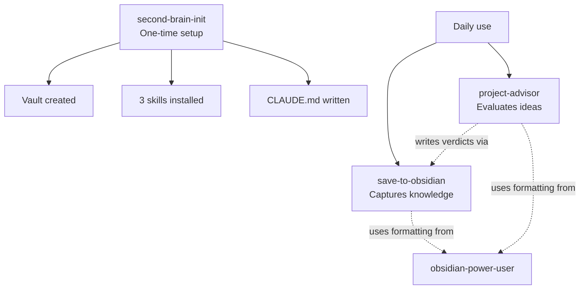

# Second Brain Starter Kit — Skills

Four skills that turn any LLM (Claude, Codex, Gemini, OpenCloud, etc.) into a
"second brain" — a knowledge system that captures what you learn, organizes it
into an Obsidian vault, and helps you decide which projects are worth your time.

## The 4 skills

| Skill | Role | When it runs |
|-------|------|--------------|
| **`second-brain-init`** | Sets up your vault and installs the other 3 skills | Once, on first install |
| **`obsidian-power-user`** | Master Obsidian skill — formatting, linking, templates, canvas, base, Dataview | Loaded automatically whenever the brain writes to your vault |
| **`save-to-obsidian`** | Captures knowledge from any conversation into your vault, plus writes a session log | When you say "save to my brain" / "guárdalo en mi cerebro" |
| **`project-advisor`** | Evaluates new project ideas with a 4-dimension scorecard before you commit time | When you say "should I do this?" / "¿vale la pena este proyecto?" |

All four skills are **bilingual (EN + ES)** at the same level.

---

## How to install

The kit is distributed as a folder, not a plugin. It works in any LLM that
supports the SKILL.md convention.

### Cowork / Claude Code

```bash
# Copy each skill folder into your skills directory
cp -r skills/* ~/.claude/skills/
```

Then in a new conversation, say:

> "Set up my second brain" / "Configura mi segundo cerebro"

`second-brain-init` will detect the install, ask 6 setup questions, build your
vault, and verify everything works.

### Codex

```bash
cp -r skills/* ~/.codex/skills/
```

Same trigger phrase to start setup.

### Gemini CLI

```bash
cp -r skills/* ~/.gemini/skills/
```

Same trigger phrase to start setup.

### Other hosts

Find your LLM's skills directory (check its docs for "skills," "agents," or
"custom commands"). Drop all four folders into that directory. Then start a
conversation with the setup trigger.

---

## How the skills work together



You will rarely call `obsidian-power-user` directly. The other skills load it
automatically when they need to write to the vault, so the output is always
proper Obsidian-native formatting (wikilinks, callouts, frontmatter, block
references).

---

## What a vault built by this kit looks like

```
{{VAULT_NAME}}/
├── 00 Inbox/                <- "Doesn't fit anywhere else yet"
├── 01 Personal Knowledge/
│   ├── People/
│   ├── Places/
│   ├── Routines/
│   └── Lessons Learned/
├── 02 Strategy/
│   ├── Vision/
│   ├── Goals/
│   ├── Decision Log/
│   └── North Star/
├── 03 Ideas & Notes/        <- Where ideas land before they become projects
├── 04 Learning/
│   ├── Books/
│   ├── Courses/
│   ├── AI & Tech/
│   └── Business/
├── 05 AI System/
│   ├── Skills/
│   ├── Integrations/
│   └── Architecture/
├── 06 Session Logs/         <- Full conversation history
├── Excalidraw/
└── Templates/
```

Section names use number prefixes (`01`, `02`, etc.). If you rename a section
(e.g., "01 Personal Knowledge" → "01 Company Knowledge"), the skills still find
it because they route by prefix, not by full name.

---

## What this kit does NOT do

- It does not require Obsidian.app to be installed — the files are plain markdown
  and work in any editor. Obsidian just gives you the graph view and linking UX.
- It does not depend on Notion. There's an **optional** Notion mirror in
  `project-advisor` — if you don't use Notion, leave it disabled.
- It does not include AI memory, account integrations, or third-party connectors.
  Those depend on your host LLM. This kit is the **brain** layer.
- It does not migrate your existing notes. It builds the structure; you decide
  what to import.
- It does not run on a schedule or in the background. Every action is triggered
  by you, in a conversation.

---

## Customizing the kit

Almost everything is configured in `CLAUDE.md` (written by `second-brain-init`):

| Placeholder | What it controls |
|-------------|------------------|
| `{{USER_NAME}}` | How the brain refers to you |
| `{{BUSINESS_NAME}}` | Your role/business context (optional) |
| `{{VAULT_NAME}}` | What to call your brain |
| `{{VAULT_PATH}}` | Where it lives |
| `{{NORTH_STAR_NAME}}` | What you call your long-term vision |
| `{{TRIGGER_PHRASE_SAVE}}` | The phrase that triggers `save-to-obsidian` |
| `{{PRIMARY_LANGUAGE}}` | Default language for outputs |
| `{{NOTION_ENABLED}}` | Whether `project-advisor` mirrors to Notion |

Edit `CLAUDE.md` any time. The skills re-read it at the start of every conversation.

---

## License & sharing

This kit is meant to be **shared freely with family and friends**. Use it,
remix it, extend it, build vertical packs on top of it (Painters / Real Estate /
Consulting / Restaurant — whatever shape your work takes). The point is to give
someone a working brain on day one and let them grow it from there.

---

## Credits

Built as part of the Second Brain Starter Kit project. See the project's
top-level `README.md` for the broader vision and the PDF manual for the
zero-technical user walkthrough.
