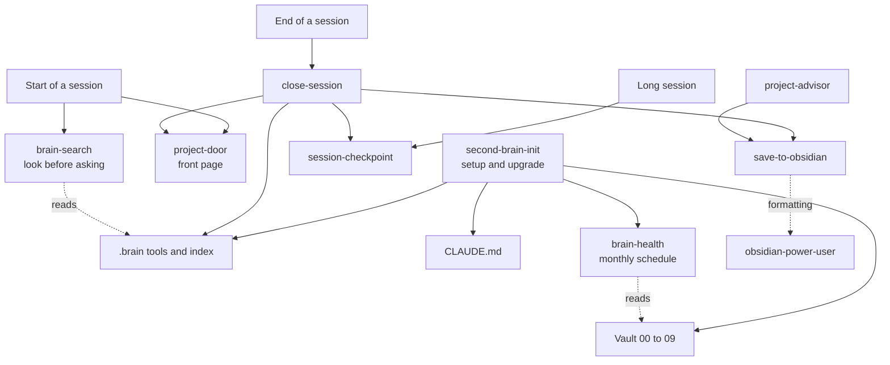

# Second Brain Starter Kit v2.0: Skills

Nine skills that turn any LLM (Claude, Codex, Gemini, and others) into a second brain:
a knowledge system that captures what you learn, files it in an Obsidian vault, finds it
again before asking you, keeps every project's current state on one page, and checks its
own health every month.

## The nine skills

| Skill | Role | When it runs |
|-------|------|--------------|
| **`second-brain-init`** | Builds the vault, puts the tools in it, writes CLAUDE.md, upgrades v1 | Once, at install (or to upgrade) |
| **`obsidian-power-user`** | Obsidian expert: formatting, links, templates, canvas, bases, Dataview | Behind the others whenever they write |
| **`save-to-obsidian`** | Saves knowledge and a session log, links it, checks the frontmatter | "save to my brain" / "guárdalo en mi cerebro" |
| **`brain-search`** | Searches the vault (local full-text index) before answering or asking | "what did we decide about X?" / "¿qué decidimos sobre X?" |
| **`project-door`** | One "Door" note per project: current state, numbers, next steps | "where are we with X?" / "¿en qué quedamos con X?" |
| **`session-checkpoint`** | Rolling save point per project during long sessions | Every 15 to 20 exchanges, and after a compression |
| **`close-session`** | Checkpoint, Door, save, reindex, optional git commit | "close the session" / "blindemos" |
| **`brain-health`** | Monthly checkup with a traffic light and a history; manages the schedule | "brain health" / "salud del cerebro", and the 1st of each month |
| **`project-advisor`** | Scores a new idea on 4 weighted dimensions before you commit time | "should I do this?" / "¿vale la pena?" |

All nine are **bilingual (EN + ES)** at the same level.

---

## How to install

Easiest: `bash install.sh` from the repo root (or the `curl` one-liner in the main
README). It copies the nine folders into your host's skills folder and moves any older
copy aside instead of deleting it.

By hand:

| Host | Command |
|------|---------|
| Cowork / Claude Code | `cp -r skills/*/ ~/.claude/skills/` |
| Codex | `cp -r skills/*/ ~/.codex/skills/` |
| Gemini CLI | `cp -r skills/*/ ~/.gemini/skills/` |
| Other | Copy the nine folders wherever your LLM loads skills from |

Then start a conversation with: **"Set up my second brain"** / **"Configura mi segundo
cerebro"** (or **"Upgrade my brain to v2"** if you had v1).

---

## How the skills work together


```mermaid
graph TD
    Init[second-brain-init<br/>setup and upgrade] --> Vault[Vault 00 to 09]
    Init --> Tools[.brain tools and index]
    Init --> Config[CLAUDE.md]
    Init --> Health[brain-health<br/>monthly schedule]

    Start[Start of a session] --> Door[project-door<br/>front page]
    Start --> Search[brain-search<br/>look before asking]
    Work[Long session] --> Check[session-checkpoint]
    End[End of a session] --> Close[close-session]
    Close --> Check
    Close --> Door
    Close --> Save[save-to-obsidian]
    Close --> Tools

    Advisor[project-advisor] --> Save
    Save -. formatting .-> Power[obsidian-power-user]
    Health -. reads .-> Vault
    Search -. reads .-> Tools
```

---

## The tools

`second-brain-init/tools/` holds the standard-library Python tools and one shell script.
Setup copies them to `<vault>/.brain/tools/`; every skill calls them from there.

| Tool | Job |
|------|-----|
| `brainlib.py` | Shared helpers: finds the vault, reads frontmatter, reads links |
| `brain_index.py` | Builds the full-text index (`.brain/brain.sqlite`, SQLite FTS5) |
| `brain_search.py` | Searches it, ranked by relevance, with filters |
| `check_frontmatter.py` | Checks notes against the contract in `.brain/vocabulary.json` |
| `door.py` | Reads a project Door by sections, creates new Doors |
| `brain_health.py` | Measures the vault and writes the health history |
| `schedule_health.sh` | Turns the monthly health check on or off (launchd, cron, schtasks) |
| `vocabulary.json` | The closed lists: types, statuses, projects. Yours to edit |

Python is optional. Without it, the skills fall back to plain text search and manual
checks.

---

## What a vault built by this kit looks like

```
{{VAULT_NAME}}/
├── 00 Inbox/
├── 01 Personal Knowledge/   People/ Places/ Routines/ Lessons Learned/
├── 02 Strategy/             Vision/ Goals/ Decision Log/ North Star/
├── 03 Ideas & Notes/        References/
├── 04 Learning/             Books/ Courses/ AI & Tech/ Business/
├── 05 AI System/            Skills/ Integrations/ Architecture/
├── 06 Session Logs/
├── 07 Assets/
├── 08 Projects/
├── 09 MOCs/
├── Archives/
├── Templates/
├── Excalidraw/
└── .brain/                  tools/ vocabulary.json brain.sqlite health.log
```

Sections are routed by number prefix, not by full name.

---

## Customizing

`CLAUDE.md` (written by setup) holds your answers:

| Placeholder | Controls |
|-------------|----------|
| `{{USER_NAME}}` | How the brain calls you |
| `{{BUSINESS_NAME}}` | Your role or business (optional) |
| `{{VAULT_NAME}}` / `{{VAULT_PATH}}` | Your brain's name and folder |
| `{{PRIMARY_LANGUAGE}}` | Default language of headings and summaries |
| `{{NOTION_ENABLED}}` | Whether `project-advisor` mirrors to Notion |
| `{{HEALTH_SCHEDULED}}` | Whether the monthly health check runs by itself |
| `{{TRIGGER_PHRASE_SAVE}}` | Your phrase for saving |

`.brain/vocabulary.json` holds the closed lists of note types, statuses and projects.
Add to it as your brain grows; every tool follows.

---

## What this kit does not do

- It does not require Obsidian.app: the notes are plain Markdown.
- It does not depend on Notion or any account.
- It does not migrate your old notes; `obsidian-power-user` has the import guides.
- It runs nothing in the background except the monthly health check, and only if you
  say yes.

## License and sharing

MIT. Share it freely, remix it, build vertical packs on top of it.
