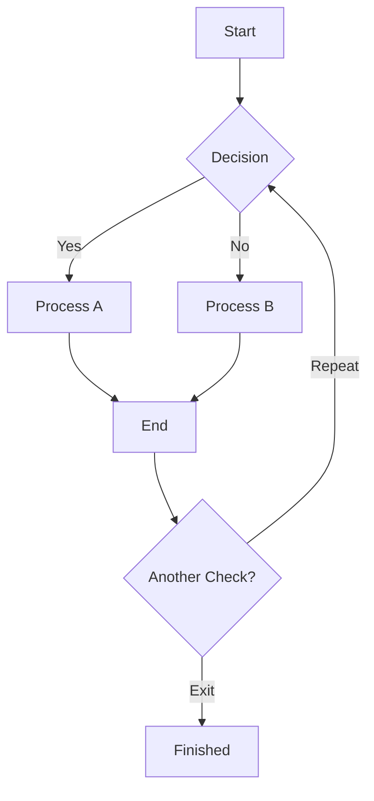
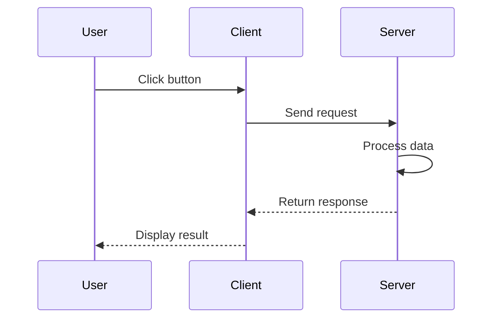
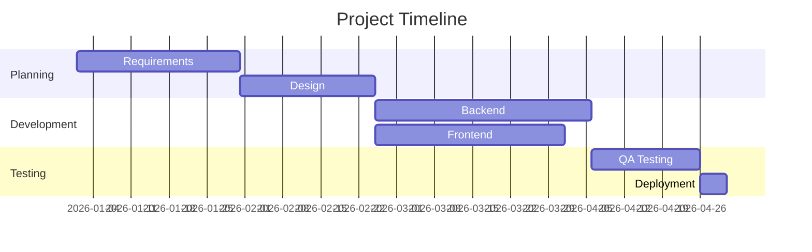
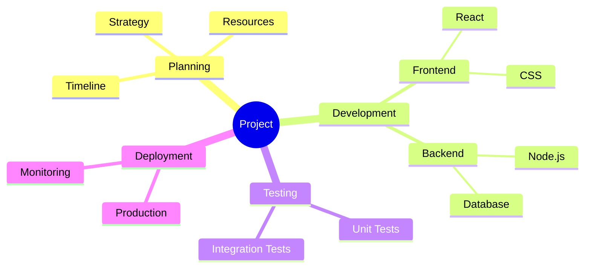

# Obsidian Editing & Formatting Reference

## Basic Syntax

### Headings
```markdown
# Heading 1
## Heading 2
### Heading 3
#### Heading 4
##### Heading 5
###### Heading 6
```

### Text Formatting
```markdown
**bold text** or __bold text__
*italic text* or _italic text_
***bold italic*** or ___bold italic___
~~strikethrough~~
==highlight==
`inline code`
```

### Code Blocks
```markdown
`single line code`

```javascript
function hello() {
  console.log("Hello, World!");
  return true;
}
```

```python
def fibonacci(n):
    if n <= 1:
        return n
    return fibonacci(n-1) + fibonacci(n-2)
```

```css
.container {
  display: flex;
  justify-content: center;
  align-items: center;
}
```

```html
<div class="example">
  <p>This is HTML</p>
</div>
```
```

### Lists

**Unordered List:**
```markdown
- Item 1
- Item 2
  - Nested item 2.1
  - Nested item 2.2
    - Double nested item 2.2.1
- Item 3
```

**Ordered List:**
```markdown
1. First item
2. Second item
   1. Nested ordered 2.1
   2. Nested ordered 2.2
3. Third item
```

**Task Lists:**
```markdown
- [ ] Uncompleted task
- [x] Completed task
- [ ] Subtask
  - [ ] Nested subtask
  - [x] Completed nested task
```

### Tables
```markdown
| Left Align | Center Align | Right Align |
|:-----------|:------------:|------------:|
| L1         |      C1      |          R1 |
| L2         |      C2      |          R2 |
| L3         |      C3      |          R3 |
```

### Horizontal Rule
```markdown
---
or
***
or
___
```

### Blockquotes
```markdown
> Single line blockquote

> Multi-line blockquote
> continues here
> and here

> Nested blockquote
> > Level 2 blockquote
> > > Level 3 blockquote
```

### Inline Comments
```markdown
This text is visible %%but this comment is hidden%% and continues here.

%%
Multi-line
comment block
that is completely hidden
%%
```

---

## Math

### Inline Math
```markdown
The formula $E = mc^2$ is famous.

Inline integral: $\int_0^\infty e^{-x^2} dx$

Fractions in text: $\frac{1}{2}$ and $\frac{n(n+1)}{2}$
```

### Block Math (LaTeX)
```markdown
$$
E = mc^2
$$

$$
\frac{-b \pm \sqrt{b^2 - 4ac}}{2a}
$$

$$
\sum_{i=1}^{n} i = \frac{n(n+1)}{2}
$$

$$
\int_{-\infty}^{\infty} e^{-x^2} dx = \sqrt{\pi}
$$

$$
\begin{bmatrix}
1 & 2 & 3 \\
4 & 5 & 6 \\
7 & 8 & 9
\end{bmatrix}
$$

$$
\begin{align}
x + y &= 5 \\
2x - y &= 1
\end{align}
$$

$$
P(A|B) = \frac{P(B|A)P(A)}{P(B)}
$$
```

---

## Mermaid Diagrams

### Flowchart


### Sequence Diagram


### Gantt Chart


### Mindmap


---

## Obsidian Flavored Markdown — Callouts

### All Callout Types

```markdown
> [!NOTE]
> This is a note callout.

> [!TIP]
> A helpful tip or best practice.

> [!INFO]
> Informational callout.

> [!WARNING]
> A warning message.

> [!SUCCESS]
> Task completed successfully.

> [!QUESTION]
> Something that needs clarification.

> [!FAILURE]
> Something that did not work.

> [!DANGER]
> Critical danger or error.

> [!BUG]
> A bug or issue.

> [!EXAMPLE]
> Example of a concept.

> [!ABSTRACT]
> A summary or overview.

> [!QUOTE]
> A quote or citation.
```

### Foldable Callouts
```markdown
> [!NOTE]+
> This callout is open by default.
> Content is visible.

> [!WARNING]-
> This callout is collapsed by default.
> Click to expand.
```

### Nested Callouts
```markdown
> [!NOTE]
> This is the outer callout.
>
> > [!TIP]
> > This is a nested callout inside the note.
> >
> > > [!SUCCESS]
> > > This is a third-level nested callout.
```

### Custom Title
```markdown
> [!NOTE] Custom Title
> Content with a custom title instead of default "Note".

> [!WARNING] This is Important!
> Warning with custom title.

> [!SUCCESS] Task Completed
> Custom success message.
```

---

## Tags

### Inline Tags
```markdown
This note is about #obsidian and #productivity.

I love #coffee #writing and #learning.
```

### Nested Tags
```markdown
#system/obsidian
#system/obsidian/plugins
#system/obsidian/plugins/dataview

#project/example
#project/example/marketing
#project/example/marketing/seo
```

### Tags in YAML Frontmatter
```markdown
---
title: My Note
tags: [obsidian, productivity, writing]
---

or

---
title: My Note
tags:
  - obsidian
  - productivity
  - writing
---
```

---

## Properties (YAML Frontmatter)

### Property Types with Examples

```markdown
---
title: Complete Property Reference
aliases: [alt-name, another-name]
date: 2026-04-03
created: 2026-04-01T09:30:00
modified: 2026-04-03T15:45:00
status: in-progress
type: reference
cssclasses: [dark-mode, custom-style]
author: Your Name
rating: 5
published: true
tags: [obsidian, reference, guide]
keywords: [editing, formatting, markdown]
summary: A complete guide to Obsidian editing and formatting.

# Text property (single line)
name: John Doe

# Number property
word_count: 2500
priority: 3
hours_spent: 15.5

# Date property (YYYY-MM-DD format)
due_date: 2026-04-15
release_date: 2026-05-01

# Datetime property
scheduled: 2026-04-05T14:30:00
meeting_time: 2026-04-10T10:00:00

# Boolean property
is_published: true
needs_review: false
archived: true

# List property
categories:
  - writing
  - tutorial
  - reference

collaborators:
  - Alice
  - Bob
  - Charlie

topics:
  - markdown
  - obsidian
  - formatting
---
```

### Standard Built-in Properties
- `title` — Document title
- `aliases` — Alternative names (list)
- `tags` — Tags for the note (list)
- `date` — Creation or reference date
- `created` — Creation timestamp
- `modified` — Last modification timestamp
- `status` — Status of the note (draft, in-progress, completed, etc.)
- `type` — Type classification (note, reference, guide, etc.)
- `cssclasses` — Custom CSS classes for styling

---

## Attachments & Embeds

### Images
```markdown
# Embed image with default size
![[image.png]]

# Embed image with custom width
![[image.png|300]]

# Embed image with width and height
![[image.png|300x200]]

# Image with link (in reading view)
[](https://example.com)
```

### Audio
```markdown
![[audio-file.mp3]]

![[recording.wav]]

![[podcast.m4a]]
```

### Video
```markdown
![[video.mp4]]

![[movie.webm]]

![[clip.mov]]
```

### PDF
```markdown
![[document.pdf]]

# Embed specific PDF page
![[document.pdf#page=5]]
```

### Other Files
```markdown
![[spreadsheet.xlsx]]

![[presentation.pptx]]

![[archive.zip]]
```

---

## Views & Editing Modes

### Source Mode
- Raw markdown syntax is visible
- Edit markdown directly with full syntax visibility
- Toggle: `Ctrl+Shift+` on Windows/Linux, `Cmd+Shift+` on Mac

### Live Preview
- Markdown renders in real-time as you type
- Syntax highlighted but rendered
- Hybrid of source and reading view
- Default in modern Obsidian versions
- Toggle with view options

### Reading View
- Fully rendered, no markdown syntax visible
- Read-only mode
- Best for consuming notes
- Click "eye" icon or use view switcher

### Switching Between Modes
```
Source Mode ←→ Live Preview ←→ Reading View
```

---

## Additional Features

### Folding Headings
```markdown
# Main Section
Some content here.

## Subsection
More content.

### Sub-subsection
Even more content.

%% Click arrow next to heading to fold/collapse %%
%% Only visible in Live Preview and Reading View %%
```

### Folding Lists
```markdown
- Parent item (has arrow if list is long)
  - Child 1
  - Child 2
  - Child 3

%% Click arrow to collapse child items %%
```

### Multiple Cursors
```
Ctrl+D (Windows/Linux) or Cmd+D (Mac)
- Selects current word
- Press again to select next occurrence
- Allows simultaneous editing of multiple instances
- Escape to exit multi-cursor mode
```

### Embedding Web Pages (iframe)
```markdown
<iframe src="https://example.com" width="800" height="600"></iframe>

<iframe src="https://www.youtube.com/embed/dQw4w9WgXcQ" width="560" height="315"></iframe>
```

### Raw HTML in Markdown
```markdown
<div style="background-color: #f0f0f0; padding: 10px; border-radius: 5px;">
  <p>This is a styled HTML block inside markdown.</p>
</div>

<details>
  <summary>Click to expand</summary>
  Hidden content revealed on click.
</details>

<span style="color: red;">Colored inline text</span>
```

### Key Editing Shortcuts

| Action | Windows/Linux | Mac |
|--------|---------------|-----|
| Bold | Ctrl+B | Cmd+B |
| Italic | Ctrl+I | Cmd+I |
| Strikethrough | Ctrl+Shift+X | Cmd+Shift+X |
| Inline code | Ctrl+` | Cmd+` |
| Code block | Ctrl+Shift+` | Cmd+Shift+` |
| Create link | Ctrl+K | Cmd+K |
| Toggle checklist | Ctrl+Shift+C | Cmd+Shift+C |
| Toggle bullet list | Ctrl+Shift+L | Cmd+Shift+L |
| Toggle ordered list | Ctrl+Shift+E | Cmd+Shift+E |
| Increase heading level | Ctrl+] | Cmd+] |
| Decrease heading level | Ctrl+[ | Cmd+[ |
| Multi-cursor word | Ctrl+D | Cmd+D |
| Find/Replace | Ctrl+H | Cmd+H |
| Command palette | Ctrl+P | Cmd+P |
| Open file search | Ctrl+Shift+P | Cmd+Shift+P |
| Toggle sidebar | Ctrl+\ | Cmd+\ |
| Toggle reading view | Ctrl+Shift+E | Cmd+Shift+E |
| Fold/Unfold | Ctrl+Alt+F | Cmd+Option+F |

---

## Internal Links & Cross-References

### Basic Link Syntax
```markdown
[[Note Name]]
[[Note Name|Display Text]]
[[Folder/Note Name]]
[[Note Name#Heading]]
[[Note Name^block-id]]
```

### Block References
```markdown
This is a paragraph with a block ID.
^my-block-id

Reference it elsewhere: [[Note Name^my-block-id]]
```

### Backlinks
```markdown
%% Automatically generated in Backlinks panel %%
%% Shows all notes that link to this note %%
%% Visible in right sidebar %%
```

---

## Wikilinks vs Markdown Links

```markdown
% Wikilink (Obsidian-specific) - best for internal notes
[[My Note]]
[[My Note|Custom Display Text]]

% Markdown link (standard) - works everywhere
[Display Text](https://example.com)
[Internal Link](./path/to/note.md)
```

